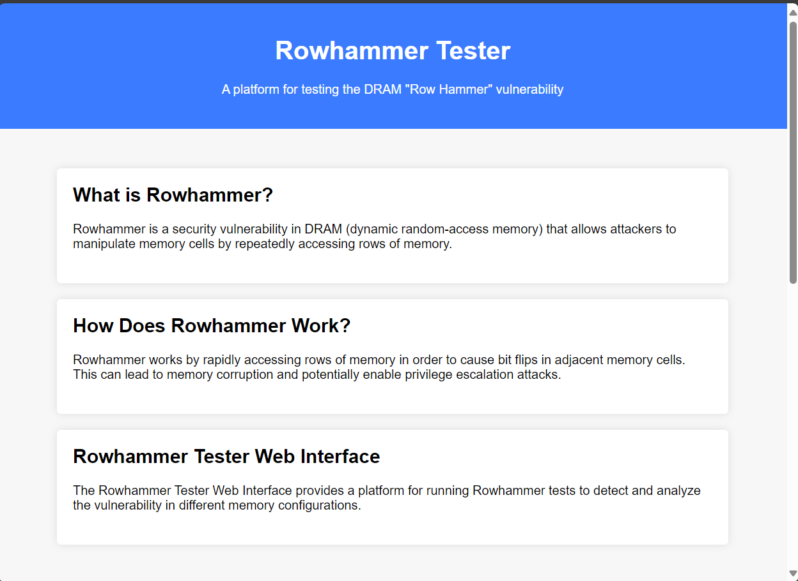
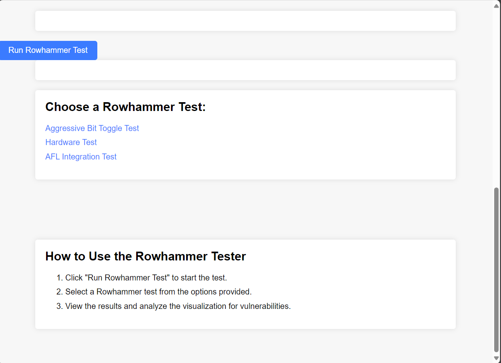

# Hardware Security Analysis and SecureOS-VulnerabilityMitigation

This repository contains various tools and tests related to hardware security analysis and vulnerability mitigation.

## Overview

### DRAM "Rowhammer" Problem

"Rowhammer" is a problem with recent DRAM modules in which repeatedly accessing a row of memory can cause bit flips in adjacent rows. This repository contains programs for testing the rowhammer problem, which run as normal userland processes.

The rowhammer problem is described in Yoongu Kim et al's paper, "[Flipping Bits in Memory Without Accessing Them: An Experimental Study of DRAM Disturbance Errors](http://users.ece.cmu.edu/~yoonguk/papers/kim-isca14.pdf)" (2014).

## Directory Structure

The repository follows the following directory structure:

- **src**: Contains the source code files for the project.
- **tests**: Contains various test programs and scripts used for testing and analysis.


## Building and Running the Tests

### Tests

#### rowhammer_test_v2.c

- **Description**: This file contains an updated version of the Rowhammer test, focusing on memory manipulation techniques.
- **Language**: C
- **Usage**:
  1. Navigate to the `tests` directory.
  2. Compile the test file:
     ```bash
     gcc rowhammer_test_v2.c -o rowhammer_test_v2
     ```
  3. Run the test:
     ```bash
     ./rowhammer_test_v2
     ```

#### rowhammer_test.cc

- **Description**: This file contains the original Rowhammer test written in C++.
- **Language**: C++
- **Usage**:
  1. Navigate to the `tests` directory.
  2. Compile the test file:
     ```bash
     g++ rowhammer_test.cc -o rowhammer_test
     ```
  3. Run the test:
     ```bash
     ./rowhammer_test
     ```

#### rowhammer.c

- **Description**: This file provides the core implementation of the Rowhammer test in C.
- **Language**: C
- **Usage**:
  1. Navigate to the `tests` directory.
  2. Compile the test file:
     ```bash
     gcc rowhammer.c -o rowhammer
     ```
  3. Run the test:
     ```bash
     ./rowhammer
     ```

## Additional Tests

### hardware_test.c

- **Description**: This file contains tests for measuring the latency and bandwidth of memory accesses.
- **Language**: C
- **Usage**:
  1. Navigate to the `tests` directory.
  2. Compile the test file:
     ```bash
     gcc hardware_test.c -o hardware_test
     ```
  3. Run the test:
     ```bash
     ./hardware_test
     ```

### aggressive_bit_toggle.c

- **Description**: This file contains a test for aggressively toggling bits in memory to simulate potential vulnerabilities.
- **Language**: C
- **Usage**:
  1. Navigate to the `tests` directory.
  2. Compile the test file:
     ```bash
     gcc aggressive_bit_toggle.c -o aggressive_bit_toggle
     ```
  3. Run the test:
     ```bash
     ./aggressive_bit_toggle
     ```

### afl_integration.c

- **Description**: This file demonstrates integration with AFL for fuzz testing.
- **Language**: C
- **Usage**:
  1. Navigate to the `tests` directory.
  2. Compile the integration test with AFL:
     ```bash
     afl-gcc afl_integration.c -o afl_integration
     ```
  3. Run AFL fuzz testing:
     ```bash
     afl-fuzz -i input_dir -o output_dir -- afl_integration @@
     ```
     Replace `input_dir` with the directory containing input seed files (if any), `output_dir` with the directory to store AFL's findings and crashes, and `afl_integration` with the name of the compiled executable.


## Rowhammer Tester

This section provides details about the Rowhammer Tester Web Interface and how to use it.

### Rowhammer Tester Web Interface

The Rowhammer Tester Web Interface provides a platform for running Rowhammer tests to detect and analyze the vulnerability in different memory configurations.



### How to Use the Rowhammer Tester Web Interface

1. Click on the "Run Rowhammer Test" button to start the test.
2. Select a Rowhammer test from the options provided.
3. View the test results and analyze the visualization to detect any memory vulnerabilities.

